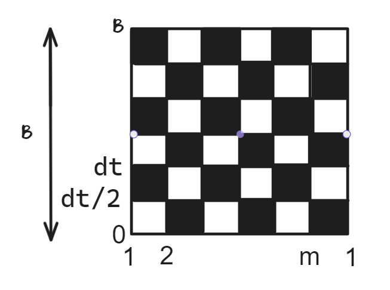
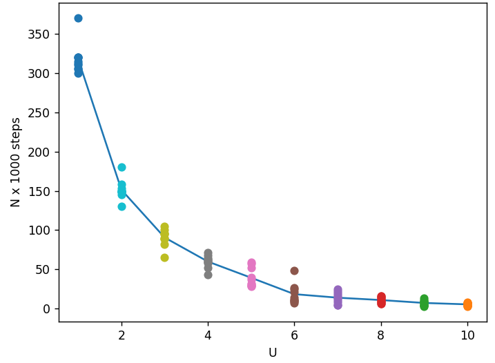

> Исследование скорости сходимости в зависимости от параметра U/t
>
> Козодаев А.М
>
> 5 мая 2025 г.

1 Введение

Глобальной целью в данной работе является исследование сходимости
квантового алгорит-ма Монте-Карло для одномерной цепочки бесспиновых
частиц. В качестве рассматриваемой модели, возьмём модель Хаббарда.

1.1 Модель Хаббарда

Для объяснения фазовых переходов "метал - изолятор"Хаббард предложил
модель, которая в режиме сильной связи позволила описать переход из
проводящего состояния в диэлектриче-ское с учётом перескоков электронов
на соседние атомы и кулоновского отталкивания на узле. Гамильтониан
Хаббарда имеет вид:

> X X X X
>
> H = −t (ai ai+1 +ai+1ai)+ U ni +V nini+1 −µ ni (1)
> H = -t\sum_i(a_i^+a_{i+1} + a_{i+1}^+a_i) + U\sum_in_i^2 + V\sum_i n_in_{i+1} - \mu\sum_in_i
> i i i i

Здесь первый член описывает перескоки частиц на соседние узлы с
амплитудой t. Второй член описывает кулоновское отталкивание частиц на
узле с потенциалом U. Третий член учитывает кулоновское взаимодействие
частиц на соседних узлах. Важно отметить, что узельный базис в модели
подбирается так, что число частиц постоянно. Для моделирования системы с
заданным выше гамильтонианов использую подход Фейнмана.

1.2 Алгоритм шахматной доски

Впервые, подход к решению таких задач был сформулирован Ричардом
Фейнманом (Модель шахматной доски Фейнмана). Эта модель подразумевает
преобразование пространство размер-ности d в пространство размерности
d+1, путём добавления измерения "мнимого времени"τ. Тогда модель можно
визуализировать, рассматривая случайные блуждания на шахматной дос-ке.
Ось мнимого времени длины β = 1 с помощью разбиения Сузуки - Троттера
разбивается на M частей с длиной ∆τ. В такой модели задачу можно
наглядно проиллюстрировать с помощью шахматной доски рис. 1.

> 1

> Рис. 1: Модель "шахматной доски"@

Добавив граничные условия для оси узлов m+1=1(ось х) и оси мнимого
времени M+1=0 (ось y) получим замкнутое пространство ввиде тора.

2 Алгоритм Монте-Карло для шахматной доски

> Шаг 1. Выбираем случайный белый квадрат.
>
> Шаг 2. Определяем координаты 4 чёрных квадратов – соседей белого

Шаг 3. Определяем направление процедуры. После, проверяем возможна ли
такая процеду-ра (населённость узла в начальной и конечной точке должна
быть \>0 и \<nmax соответственно). Если процедура невозможна, переходим
на следующий шаг МК.

Шаг 4. Если процедура возможна, происходит изменение траектории в
соответствии с алго-ритмом Метрополиса. Для этого вычисляются веса old и
new конфигураций, равные произведе-

нию весов каждого из 4 черных квадратов. На основании отношения wnew
принимается решение о смене конфигурации. old

Шаг 5. В случае, если конфигурация принимается, вычисляем изменение
энергии dE = Enew˘Eold

Шаг 6\*. Начиная с некоторого числа шагов Nterm, требующегося для
термализации си-стемы, каждые например 1000 шагов, будем вычислять
автокорреляционную функцию, соот-ветствующее ей среднеквадратичное
отклонение и погрешность. Каждый раз, основываясь на полученном значении
погрешности будем принимать решение о завершении вычислений.

> 2

3 Устройство программы

Вспомним исходную постановку задачи, требуется “исследовать скорость
сходимости в за-висимости от параметра U”. Основной алгоритм задаётся в
файле “Monte-Carlo”, из которого в свою очередь вызываются необходимые
функции. Сначала задаются основные параметры системы (nmax, m, M, t, U,
V, mu, dt, beta), начальные населённости на каждом из узлов и
рассчитывается начальная энергия системы. Для рассчёта начальной
энергии, как и для после-дующего вычисления весов требуется построить
матричную экспоненту e−H∆τ и её произведение с гамильтонианом He−H∆τ,
эти вычисления проведены в функции “He”. Базис волновых функ-ций и
опреаторы рождения/уничтожения частиц на узле реализованы функциями
“convert-to”, “a-plus”, “a-minus” соответственно.

В процессе решения задачи требуется определять координаты чёрных
квадратов, окружаю-щих некоторый белый квадрат. Эта процедура
реализована в функции “black-coordinates”, ко-торая возвращает
координаты квадратов в порядке up, left, down, right. Сами же координаты
записаны в порядке down-left, down-right, up-left, up-right.
Вспомогательная “bound-cond” про-веряет выполнение граничных условий. В
основном коде, в цикле МК, выполняется проверка относительной
погрешности вычисления энергии каждые 1000 шагов с помощью
автокорреля-ционной функции.

Для полного ознакомления с кодом можно перейти по ссылке:
[https://drive.google.com/](https://drive.google.com/drive/folders/11lA_XUseL0TCN8FVtrYuPvu4qpJNnwzM?usp=drive_link)
[drive/folders/11lA_XUseL0TCN8FVtrYuPvu4qpJNnwzM?usp=drive_link](https://drive.google.com/drive/folders/11lA_XUseL0TCN8FVtrYuPvu4qpJNnwzM?usp=drive_link)

4 Результаты вычислений

В работе была исследована зависимость числа шагов N алгоритма МК,
требующихся, что-бы дойти до точности 0.01 от значения параметра U. В
качестве начальных параметров были выбраны следующие значения: nmax = 5,
m = 6, t = 1, V = 3, M = 10, µ = 0, β = 5. С такими параметрами была
посчитана скорость сходимости для U = 1, 2, 3,..., 10. Для каждой точки
U алгоритм МК запущен 10 раз, каждая из этих точек нанесена на график.
После чего построена непрерывная зависимость N(U) по средним значениям
рассчитанных точек.

> 3

> Рис. 2: Зависимость числа шагов алгоритма МК до сходимости к 0.01 от
> параметра U

Изполученныхданныхследует,чтоприувеличениипараметраUскоростьсходимостиувели-чивается,
в частности, при уменьшении U от 10 до 1, число шагов, необходимых для
сходимости увеличивается почти на 2 порядка.

> 4
